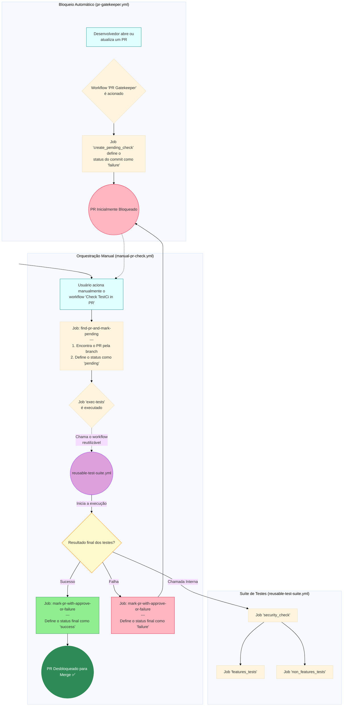

# TestCI
=======
# Fluxo de CI/CD do Projeto TestCI

Este documento descreve o fluxo de CI implementado para este projeto, garantindo a qualidade e a segurança antes da integração de código na branch principal.

## Fluxograma do Processo

O diagrama abaixo ilustra a interação entre os três workflows: o bloqueio automático de PRs, a verificação manual que orquestra os testes, e a suíte de testes reutilizável.

